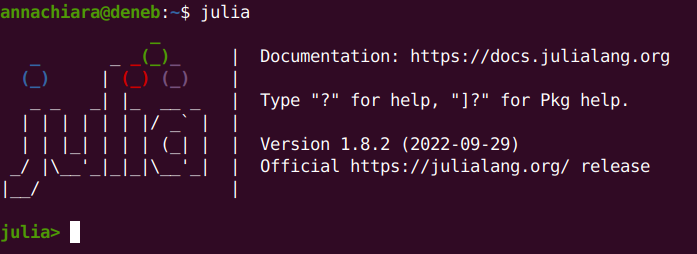
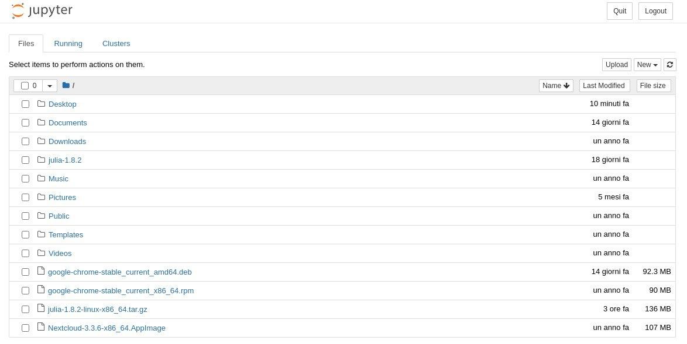
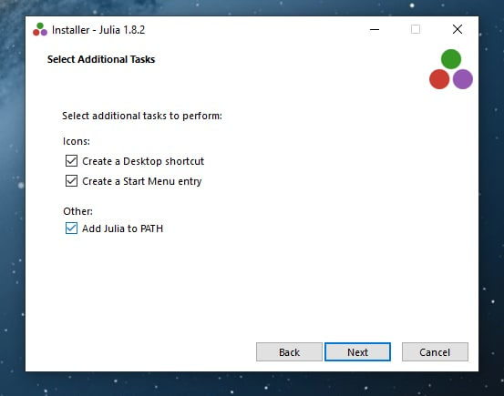
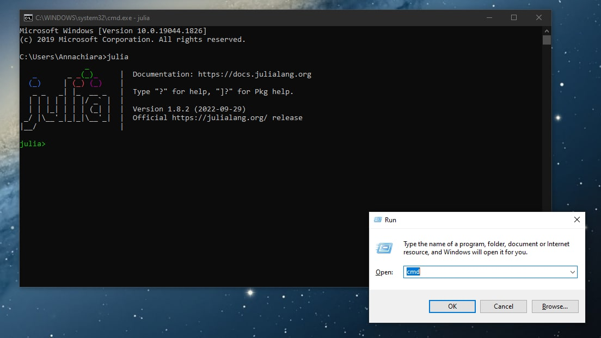
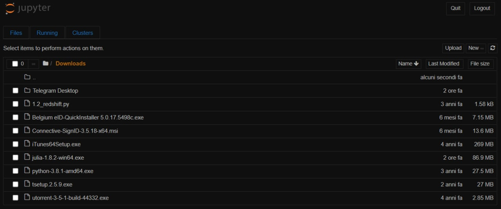

# Julia setup

This class will include computational examples that are programmed in the [julia](https://julialang.org/) programming language. Julia is a JIT (just-in-time) language which allows to write very fast code (very close to the performance of compiled languages like C and Fortran), while still having the simplicity of an interpreted language like python. Each of the examples included in this website can be downloaded as jupyter notebooks. The instructions below explain how to run these notebooks both in Linux and Windows systems.

## Linux

#### Download Julia

Get the version of julia that matches your system from the [downloads page](https://julialang.org/downloads/). Below instructions assume that:
- The version you downloaded is julia-1.9.3-linux-x86_64.tar.gz
- It was downloaded to your home folder, which should be something like `/home/USERNAME`.
You will need to adapt the commands below if that is not the case.

In a terminal, uncompress the file that has been downloaded by running the following commands:
```bash
# Move to the home directory
cd ~
# Uncompress the .tar.gz
tar zxvf julia-1.9.3-linux-x86_64.tar.gz
```
This will create a folder called julia-1.9.3 in `/home/USERNAME`. You can find your executable in `/home/USERNAME/julia-1.9.3/bin/julia`.

#### Setup Julia

Julia can be started by running the executable, however using the full path to it is cumbersome. We can instead create an `alias` that will let us run the executable faster. This can be done by editing (or creating if it does not exist) the `.bashrc` file, which containts a set of commands that are run at the start of each terminal session. To edit the `.bashrc` file, I am going to use the `nano` text editor, but you can use your favorite text editor.

```bash
# Open the .bashrc file
nano ~/.bashrc
```

Copy and paste the following line at the bottom of the file:

```bash
alias julia=/home/USERNAME/julia-1.9.3/bin/julia
```

To save changes and exit from nano, you'll have to press `ctrl+X` , then `Y` to accept to save the modified buffer and then `enter`. Now, everytime you'll open a shell, you'll be able to call Julia by simply typing in a terminal

```bash
#Open Julia
julia
```

Try it and see the greeting message 😁



#### Setup the Julia notebook

We want to get the Julia notebook now, to be able to execute an .ipynb file. It is also recommended to create a unique environment for each julia project you work with, this lets you install specific dependencies for different projects, avoid conflicts, and make your calculations reproducible (this is similar to conda environments in case you're familiar with those). Within Julia, type the following in your terminal:

```bash
# Open up the package manager
]
# create a local environment
activate .
# Install the Julia notebook package
add IJulia
```

The installation of the notebook should take a few minutes. At the end, press ```ctrl+C``` to go out of the package manager. Within Julia, type

```bash
# Declare that you'll use the Julia notebook package
using IJulia
# Call the Julia notebook package
notebook()
```

If you're asked to install Jupyter via Conda, accept by pressing ```Y+enter```. This should get you Jupyter notebook, the web-based computing platform that will run your Julia notebooks in your favorite browser. This installation should also take a few minutes.

#### Open up your notebook

Once Jupyter is launched, you should see a window popping up in your favorite browser. That window is going to show you an interactive platform that lists all your files in your ```HOME_DIR```. Something like this:



At this point, you just need to find the .ipynb file you downloaded into your favorite directory in the first step. Open it, and the game is done ✅

## Windows

#### Download Julia

Get the version of julia that matches your system from the [downloads page](https://julialang.org/downloads/). Below instructions assume that the version you downloaded is julia-1.9.3-win64.exe. You will need to adapt the commands below if that is not the case.

Run the installer you just downloaded, by double clicking on the executable and giving permissions to install Julia in the suggested installation directory. Be sure to check the box asking you to "Add Julia to path", because it will automatically add Julia to Environment Variables of your system! See screenshot below:



#### Open up Julia

To open Julia we need to open a terminal, a command-line interface to communicate directly with your computer. To do so in your Windows machine, you'll need to press the shortcut ```Windows+R``` to launch the "Run" box; afterwards, type “cmd” and then click “OK” to open the Command Prompt (see screenshot below). 
Invoke Julia by simply typing ```julia``` and see the greeting message 😁 

```bash
# Open Julia
julia
```



#### Setup the Julia notebook

Once Julia is open and welcomes you, the steps to get the Julia notebook are more or less the same as you would do in Linux. Just as with linux, it is recommended to use individual environments for each project you have. Within Julia, type the following in your terminal:

```bash
# Open up the package manager
]
# create a local environment
activate .
# Install the Julia notebook package
add IJulia
```

The installation of the notebook should take a few minutes. At the end, press ```ctrl+C``` to go out of the package manager. Within Julia, type

```bash
# Declare that you'll use the Julia notebook package
using IJulia
# Call the Julia notebook package
notebook()
```

If you are asked to install Jupyter via Conda, accept by pressing ```Y+enter```. This should get you Jupyter notebook, the web-based computing platform that will run your Julia notebooks in your favorite browser. This installation should also take a few minutes.

#### Open up your notebook

Once Jupyter is launched, you should see a window popping up in your favorite browser. That window is going to show you a file explorer. Something like this:



At this point, you just need to find the .ipynb file you downloaded into your favorite directory in the first step. Open it, and the game is done ✅

## Julia Basics

All computational examples will be shown using the [*julia*](https://julialang.org/) programming language, but the code provided can be easily translated to other languages such as python. The main benefit of julia is that it is a language that is simple to write but can still have a performance comparable to traditional compiled languages. A good overview of the language can be found in the official [manual](https://docs.julialang.org/en/v1/manual/getting-started/), but below we show some of the basic functionality that you will need to use.

First of all, we illustrate the basic usage of julia. A normal thing you will do at the beginning of any notebook or program is to include packages. Our life is made significantly easier by people who provide these packages! To do this, one makes use of the `using` keyword. Below we include the packages we will be using in this example.

```@example tutorial
using DataFrames     # Used to deal with tabular data
using Plots          # Provides a multitude of plotting routines
using CSV            # Efficient reading of files in "comma separated values" format
using LaTeXStrings   # Makes it easy to write LaTeX strings
```

Whenever you work on a fresh environment you will find the above code fails, as the packages are not installed. As described in the error message you can correct this by running (in a different cell) `import Pkg; Pkg.add("DataFrames")`, and similarly for the other packages. Once this is done for a package, it will remain installed in your environment, and you don't need to use `Pkg.add` again (it is safe to erase the cells with that command).

The syntax of julia should be familiar to those with a python background. Assigning numerical variables and performing arithmetic operations on them is straightforward.

```@example tutorial
a = 2.0
b = pi # the definition of pi is included by default

c = a+b # addition
d = b^a # exponentiation
e = sin(b) # basic mathematical functions are also defined in the language, no need to include a package

print("c=$(c), b=$(d), c=$(e)") # $() notation is used to read the value in parenthesis into the string
```

```@example tutorial
β=1;  # Using ';' at the end of a line will hide its output
```

You also have access to basic keywords for control flow, including `if` blocks and `for` loops. Here some small notational variations arise with respect to `python`. Blocks of code are not defined by indentation but by the use of the `end` keyword.

```@example tutorial
a = 1
b = 3

if a < 2 && b < 2   # && stands for 'and'
    print("if was successful")
elseif a < 2 || b < 2   # || stands for 'or'
    print("elseif was successful")
else
    printf("Neither if or elseif were successful")
end
print("\n") # print a line break

# Add up all digits between 1 and 10 using a for loop
sumnumbers = 0
for i in 1:10
   global sumnumbers = sumnumbers+i # global keyword is to refer to scope outside of for loop
end
print("Adding all numbers between 1 and 10 gives us $(sumnumbers)")
```

We can also define functions using the `function` keyword.

```@example tutorial
function add1(x)
    return x+1
end

add1(1)
```

We often deal not just with scalars but also vectors or matrices. We can define a vector covering a range of values using the `LinRange` function.

```@example tutorial
xvals = LinRange(-5.0,5.0,11) # Create a vector with elements from -5.0 to 5.0 with 11 elements.
```

Contrary to python, arrays in julia start at position 1, so if you attempt to access `xvals[0]` you will get an error.

Beware that many operations on vectors will not work as you might naively expect. If you try computing `xvals^2`, an error will be thrown as the `^` operation is not defined between a vector and an integer. You could think that the above operation is ambiguous, do we mean that we want to take the square of each element of the vector or instead that we want to take the dot product of xvals with itself? To explicitly state that an operation is meant to be done element by element, one can use a `.` before the operation. Further information on this notation can be found [here](https://docs.julialang.org/en/v1/manual/functions/#man-vectorized).

```@example tutorial
xvals.^2
```

This can be done with any function. For instance the code below will apply our `add1` function to each element of the array.

```@example tutorial
add1.(xvals)
```

Finally, the `Plots` package allows us to easily make different kinds of plots. The example below shows a (sparsely) sampled plot of sine and cosine. The plot can be created by calling the `plot(...)` function, while things are added to it by calling the `plot!()` function. Using `!` as part of a function name is part of the style guide of julia to identify functions which modify their arguments. For example, the `sort(x)` function will return a copy of the vector `x` which is sorted, while `sort!(x)` will modify the vector `x` into a sorted version of itself (known as in place sorting).

```@example tutorial
yvals = sin.(xvals)
yvals2 = cos.(xvals)
# The LaTeX strings package allows us to write LaTeX without needing to escape backslashes
# (i.e., we can write L"\sin(x)" instead of "$\\sin(x)$").
plot(xlabel=L"$x$", ylabel=L"$y$") 
plot!(xvals, yvals, label=L"$\sin(x)$")
plot!(xvals, yvals2, label=L"$\cos(x)$",linestyle=:dash)
```